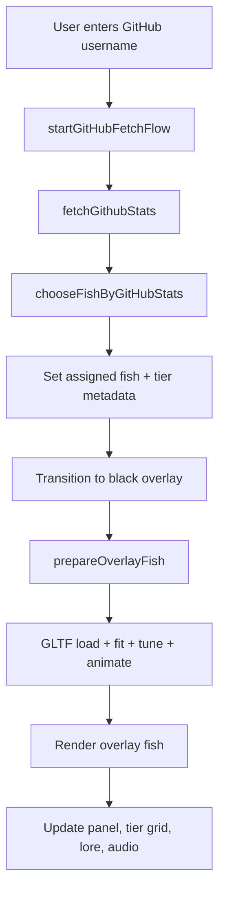
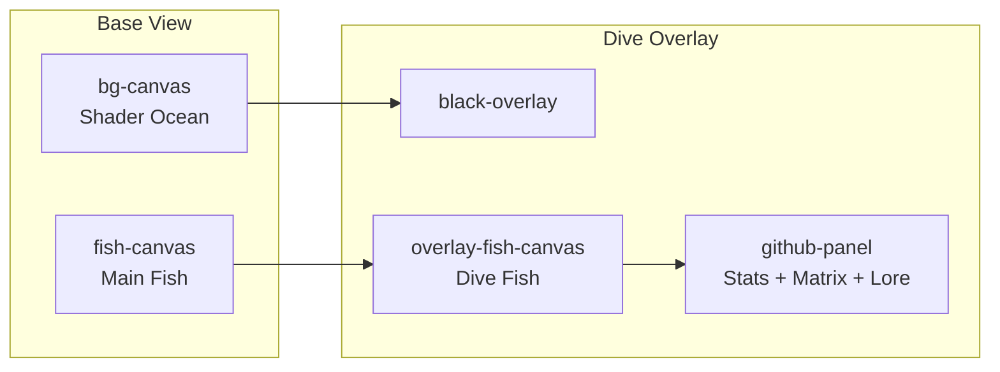
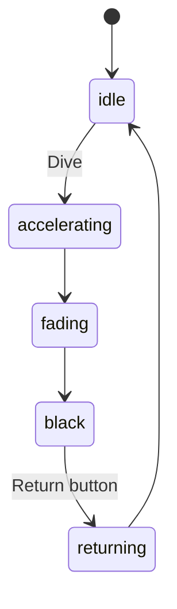

# GitHub Ocean

A cinematic, interactive Three.js experience that maps a GitHub profile to a sea creature based on coding activity.

Users with similar commit counts but different repository breadth are intentionally mapped to different creatures through a 2D tier matrix.

## Table of Contents

- [Overview](#overview)
- [Live Demo](#live-demo)
- [Core Features](#core-features)
- [Tech Stack](#tech-stack)
- [Quick Start](#quick-start)
- [Architecture](#architecture)
- [Project Structure](#project-structure)
- [How Mapping Works](#how-mapping-works)
- [Customization Cookbook](#customization-cookbook)
- [Audio System](#audio-system)
- [Performance Notes](#performance-notes)
- [Responsive Behavior](#responsive-behavior)
- [Troubleshooting](#troubleshooting)
- [Deployment](#deployment)
- [Roadmap Ideas](#roadmap-ideas)

## Overview

`GitHub Ocean` turns GitHub profile stats into a visual identity:

- `Commits` represent depth of activity.
- `Public repos` represent breadth of activity.
- The pair maps to one of `32 ocean tiers`.
- Each tier corresponds to one 3D fish/creature model.

The experience includes:

- Animated sea background shader.
- 3D fish model rendering (main scene + dive overlay scene).
- Tier matrix UI with live highlighting.
- Fish lore text.
- Ambient ocean audio + fish-specific sound loops.
- Model loader shown only while fish is not visible.

## Live Demo

- Production: [https://githubocean.vercel.app/](https://githubocean.vercel.app/)

## Core Features

- 2D stat mapping (`commit bucket x repo bucket`) to ensure fair differentiation.
- Tier override system to manually place any fish in a chosen slot.
- Per-model tuning controls:
  - `size`
  - `position` (`leftRight`, `upDown`, `frontBack`)
  - `rotation` (`turn`, `tilt`, `bank`)
  - forced facing direction
  - animation clip override
- Professional overlay panel with matrix, labels, lore, and return flow.
- Responsive layout across desktop, tablet, and phone breakpoints.
- Optimized renderer DPR caps for smoother performance.

## Tech Stack

- `Three.js` for 3D rendering.
- `GLTFLoader` for `.glb` models.
- Custom GLSL sea shader from `assets/shaders/seascape.glsl`.
- Vanilla JS modules (`src/main.js`) and CSS (`src/style.css`).
- GitHub REST API for profile + commit count lookup.
- Web Audio API for procedural ocean ambience.

## Quick Start

Use a local static server (required for module imports and GLB/shader loading).

```bash
# Option 1
npx serve .

# Option 2
python -m http.server 8080
```

Open:

- `http://localhost:3000` for `serve`
- `http://localhost:8080` for Python

For deployed use on Vercel, this project should call the bundled serverless API, not GitHub directly from the browser.
Set `GITHUB_TOKEN` in your Vercel project environment variables before deploying.

## Architecture

### High-Level Runtime



### Scene Layout



### Transition State Machine



## Project Structure

### Current Structure

```text
github_ocean/
  index.html
  site.webmanifest
  README.md
  src/
    main.js                 # runtime logic: rendering, mapping, transitions, audio
    style.css               # UI, layout, responsive rules
  docs/
    FISH_MAPPING.md         # tier/bucket mapping reference
  assets/
    models/                 # .glb creatures (32 tier assignments)
    shaders/
      seascape.glsl         # ocean background fragment logic
    media/
      *.mp4                 # overlay water video loops
    audio/
      fish/
        .gitkeep            # put fish-specific .mp3 loops here
    icons/                  # favicon + PWA icons
    fonts/                  # custom font files + font license/info
```

### Folder Rules (Recommended)

- `src/` only code (`.js`, `.css`).
- `assets/` only static files (models, media, shader, icons, fonts, audio).
- `docs/` only documentation.
- Keep model filenames stable once mapped in `FISH_CATALOG`.
- Keep fish audio files in `assets/audio/fish/` with slug-style names (`apex_leviathan.mp3`).
- Avoid duplicate model variants in production (for example files ending with ` copy.glb`), unless intentionally kept for testing.

## How Mapping Works

Mapping is 2D, not 1D.

- Commit limits: `[120, 320, 700, 1500, 3200, 7000, 14000]` -> `8` commit buckets.
- Repo limits: `[4, 10, 21]` -> `4` repo buckets.
- Total tiers: `8 x 4 = 32`.

Formula:

```text
tierIndex = (commitTier * 4) + repoTier
```

Why this matters:

- Two users can have similar commits.
- If repo breadth differs, they land on different fish.
- This solves the original “same commits, same fish” mapping problem.

For full mapping detail, see [docs/FISH_MAPPING.md](./docs/FISH_MAPPING.md).

## Customization Cookbook

All runtime customization is in [src/main.js](./src/main.js).

### 1. Add or Remove Fish Models

Edit `FISH_CATALOG`:

```js
{ name: "New Creature", path: "../assets/models/new_creature.glb" }
```

Keep exactly `32` entries if you want full 8x4 tier coverage.

### 2. Reorder Fish Into Specific Tier Slots

Use `FISH_TIER_INDEX_OVERRIDES` (1-based):

```js
const FISH_TIER_INDEX_OVERRIDES = {
  "Guppy": 5,
  "Reefback": 26
};
```

### 3. Change Global Bucket Thresholds

```js
const COMMIT_BUCKET_LIMITS = [120, 320, 700, 1500, 3200, 7000, 14000];
const REPO_BUCKET_LIMITS = [4, 10, 21];
```

If you change bucket counts, confirm matrix dimensions and fish count still align.

### 4. Tune Model Size

```js
const MODEL_SIZE_OVERRIDES = {
  "Reefback": 1.35,
  "Sea Monster": 0.9
};
```

### 5. Tune Model Position + Rotation (Simple Names)

```js
const MODEL_VIEW_TUNING = {
  "Guppy": {
    leftRight: 0.0,
    upDown: 0.1,
    frontBack: 0.0,
    turn: 0.0,
    tilt: 0.0,
    bank: 0.0
  }
};
```

### 6. Force Facing Direction (Base Turn)

```js
const MODEL_BASE_TURN_OVERRIDES = {
  "Pistosaur": Math.PI * 0.5
};
```

### 7. Force Specific Animation Clip

```js
const MODEL_ANIMATION_CLIP_OVERRIDES = {
  "Apex Leviathan": "Armature.001|Armature.001|Armature.001|Armature.001|Take 001|BaseLayer"
};
```

### 8. Add Fish Lore

Edit `FISH_SPECIAL_LORE` with path keys.

### 9. Loader Behavior

Loader element: `#model-loader`

- Shows when overlay model load starts.
- Hides as soon as fish is visible in overlay.
- Now centered in the middle of the fish pane.

### 10. Update Display Name Without Renaming File

Set the `name` in `FISH_CATALOG` (example already used for `Orca` mapped to `whale.glb`).

## Audio System

Two layers:

- Procedural ocean ambience (Web Audio API).
- Optional fish-specific loop when viewing assigned/preview fish.

### Fish Sound File Convention

Default expected path:

```text
assets/audio/fish/<slug>.mp3
```

Slug generation is automatic from fish name:

- lowercase
- spaces/symbols -> `_`

Examples:

- `Giant Manta Ray` -> `giant_manta_ray.mp3`
- `Apex Leviathan` -> `apex_leviathan.mp3`

You can override specific files via `FISH_SOUND_PATH_OVERRIDES`.

### Ocean Ducking Behavior

When fish is visible in dive mode:

- ocean gain is reduced/muted
- fish loop is prioritized

When exiting dive mode:

- fish loop stops
- ocean ambience returns

## Performance Notes

Performance caps are controlled by:

```js
const PERFORMANCE = {
  maxBgDpr: 1.25,
  maxFishDpr: 1.35,
  maxOverlayDpr: 1.0,
  overlayOpacityStep: 0.02,
};
```

Key optimizations already in place:

- DPR caps per renderer.
- Overlay mesh opacity updates quantized by step size.
- Separate main fish and overlay fish renderers.
- Transition lerp-based animation instead of abrupt jumps.

If UI feels heavy on lower-end phones:

- Reduce `maxFishDpr` and `maxOverlayDpr`.
- Reduce model scales on heaviest creatures.
- Prefer lighter GLB models for top tiers.

## Responsive Behavior

Responsive rules are in [src/style.css](./src/style.css).

The layout supports:

- desktop split pane
- tablet compressed panel
- phone-safe stacked behavior
- safe-area padding (`env(safe-area-inset-*)`)

Main responsive regions:

- `.overlay-left-pane`
- `#github-panel`
- `#overlay-fish-canvas`
- `#return-btn`

## Troubleshooting

### Loader does not disappear

- Confirm edits were made in `src/main.js` and `src/style.css`, not legacy/root copies.
- Hard refresh browser (`Ctrl+F5`).

### Fish not visible

- Check model path in `FISH_CATALOG`.
- Check model scale in `MODEL_SIZE_OVERRIDES`.
- Check placement in `MODEL_VIEW_TUNING` (`frontBack` too extreme can push it out of view).

### Mute icon toggles but no sound

- Browser may require user interaction before audio starts.
- Click page once, then toggle sound.

### GitHub fetch fails

- Verify the username exists.
- If deployed on Vercel, confirm `GITHUB_TOKEN` is set in Project Settings -> Environment Variables.
- Redeploy after adding or changing `GITHUB_TOKEN`.
- If you are testing locally, use `vercel dev` so `/api/github` is available.
- Check the browser Network tab for `/api/github?username=...` and inspect the returned JSON error.

## Deployment

This project now uses a Vercel serverless API for GitHub lookups.

Deploy on Vercel:

1. Import the repo into Vercel.
2. Add `GITHUB_TOKEN` in Project Settings -> Environment Variables.
3. Redeploy.

For local development with the API route, run:

```bash
vercel dev
```

Ensure all `assets/` paths are preserved exactly.

## Roadmap Ideas

- Per-fish mini sound design packs (`.mp3` + metadata).
- Optional mobile low-power mode toggle.
- Tier cell hover preview cards.
- Offline cache for previously loaded models.
- Admin JSON config for fish catalog without editing JS.

---

Built with Three.js and custom ocean visuals. Project maintained by Nipun Mehra.
